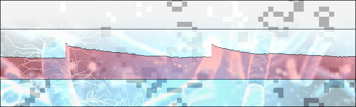

# Game-of-Life
_Javascript implementation of Conway's game of life, with Data Visualization/Analysis_
[ONLINE VERSION HERE](file:///Users/jsw/Dropbox/programming/js/GOL/GOL.html)

Conway devised the Game of Life in 1970s. It is a self-perpetuating system whereby generations of 'cells' (represented on a 2D grid) are determined by the layout of previous generation. For specific details about the rules, [read more here.](https://en.wikipedia.org/wiki/Conway%27s_Game_of_Life)

I wrote this as a fun way to learn some javascript, and see what kinds of 'animations' I could make using no frameworks or libraries. It's all just js and CSS. It includes some CSS/js data visualization modules I made that are in [this repository.](www.github.com/severalprojects/CSS_DataVis) 

I am also interested in seeing what kind of 'naive' data analysis I can do on a seemingly 'simple' closed system. For example, what is the average time to stability of a given iteration of the game? is there a relationship between seed density and time to stability? What is the distribution of the amount of ground touched by life by the time a world becomes stable? 

## TO RUN: ##

Just download the .js (2), .css (1), and .html (1) files, then open the html in your browser. _ONLINE VERSION COMING SOON_ 

## CURRENT FEATURES:##
*real-time tracking of density of life, area of the world untouched by life
*analyzes stability of a given 'world.'
*real-time visualization of life density as a scrolling line graph (toggle visibility with D-key)
*automatic reseeding (10 seconds) after stability reached 
*click to manually reseed
*automatic reseeding when window resized. 

## FORTHCOMING REVISIONS:##
*scatterplot graphing seed density vs time to stability
*distribtuion of time to stability 

